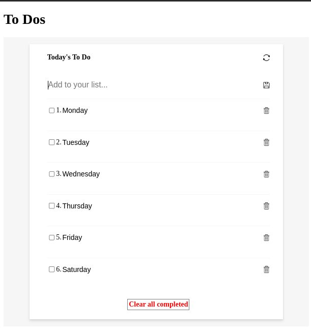
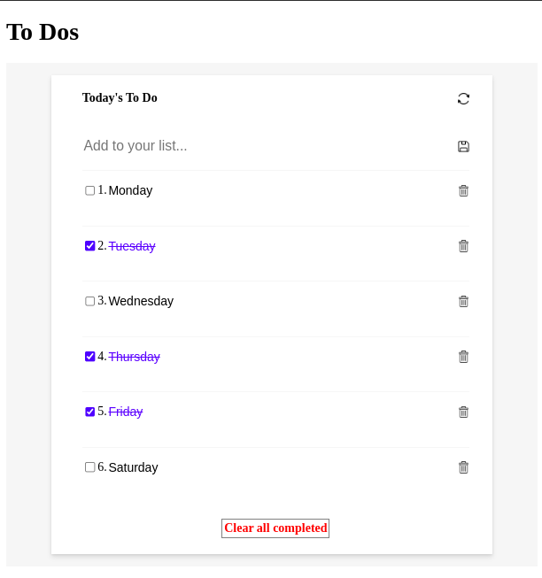

<a name="readme-top"></a>

<div align="center">
  <!-- You are encouraged to replace this logo with your own! Otherwise you can also remove it. -->
  
  <br/>

  
  <br/>
  

</div>

<!-- TABLE OF CONTENTS -->

# 📗 Table of Contents

- [📗 Table of Contents](#-table-of-contents)
- [📖 TO-DO LIST ](#-to-do-list-)
  - [🛠 Built With ](#-built-with-)
    - [Tech Stack ](#tech-stack-)
    - [Key Features ](#key-features-)
  - [🚀 Live Demo ](#-live-demo-)
  - [💻 Getting Started ](#-getting-started-)
    - [Prerequisites](#prerequisites)
    - [Setup](#setup)
    - [Install](#install)
    - [Usage](#usage)
    - [Run tests](#run-tests)
  - [👥 Authors ](#-authors-)
  - [🔭 Future Features ](#-future-features-)
  - [⭐️ Show your support ](#️-show-your-support-)
  - [🙏 Acknowledgments ](#-acknowledgments-)
  - [📝 License ](#-license-)

<!-- PROJECT DESCRIPTION -->

# 📖 TO-DO LIST <a name="about-project"></a>

**TO-DO LIST** is a tool that helps to organize your day. It simply lists the things that you need to do and allows you to mark them as complete.

## 🛠 Built With <a name="built-with"></a>

### Tech Stack <a name="tech-stack"></a>

<details>
  <summary>HTML</summary>
</details>
<details>
  <summary>Javascript: ES6</summary>
</details>
<details>
  <summary>CSS</summary>
</details>
<details>
  <summary>Webpack</summary>
</details>

<!-- Features -->

### Key Features <a name="key-features"></a>

- **List structure layout**
- **Adding a new item**
- **Removing a selected item**
- **Editing a selected item**
- **Marking a selected item as complete**
- **Removing all items marked as complete at once**
  
<p align="right">(<a href="#readme-top">back to top</a>)</p>

<!-- LIVE DEMO -->

## 🚀 Live Demo <a name="live-demo"></a>

- [Website Demo Link](https://egichuhis.github.io/to-do-list/)

<p align="right">(<a href="#readme-top">back to top</a>)</p>

<!-- GETTING STARTED -->

## 💻 Getting Started <a name="getting-started"></a>

To get a local copy up and running, follow these steps.

### Prerequisites

In order to run this project you need:

Install NodeJS on your computer. You can download the installation file from the [NodeJS website](https://nodejs.org/en/download/).

On Linux you can use your package manager, for example, on Ubuntu just run the following commands:

```sh
 sudo apt-get update
 sudo apt-get install nodejs
```

### Setup

Clone this repository to your desired folder:

Example commands:

```sh
  cd my-folder
  git clone https://github.com/egichuhis/to-do-list.git
```

### Install

Install this project with:

Example command:

```sh
  cd my-project
  npm install
```

### Usage

To run the project:

Open the Terminal / Command-Line utility in your computer / code editor.

Run `npm run start`. A browser window will be launched automatically with your project

### Run tests

To run tests, run the following commands:

Example command:

```sh
  npx hint .
  npx stylelint "**/*.{css,scss}"
  npx eslint .
```

<p align="right">(<a href="#readme-top">back to top</a>)</p>

<!-- AUTHORS -->

## 👥 Authors <a name="authors"></a>

👤 **Edwin Gichuhi**

- GitHub: [@githubhandle](https://github.com/egichuhis)
- Twitter: [@twitterhandle](https://twitter.com/egichuhis)
- LinkedIn: [LinkedIn](https://www.linkedin.com/in/edwin-gichuhi/)

<p align="right">(<a href="#readme-top">back to top</a>)</p>

## 🔭 Future Features <a name="future-features"></a>

- [ ] **Reordering a selected item (as drag-and-drop)**

<p align="right">(<a href="#readme-top">back to top</a>)</p>

<!-- SUPPORT -->

## ⭐️ Show your support <a name="support"></a>

If you like this project, give it a ⭐️!

<p align="right">(<a href="#readme-top">back to top</a>)</p>

<!-- ACKNOWLEDGEMENTS -->
## 🙏 Acknowledgments <a name="acknowledgements"></a>

I would like to thank [Microverse](https://www.microverse.org/) for this opportunity that has enabled me to learn a lot and grow my skills.

<p align="right">(<a href="#readme-top">back to top</a>)</p>

<!-- LICENSE -->

## 📝 License <a name="license"></a>

This project is [MIT](./MIT.md) licensed.

<p align="right">(<a href="#readme-top">back to top</a>)</p>
